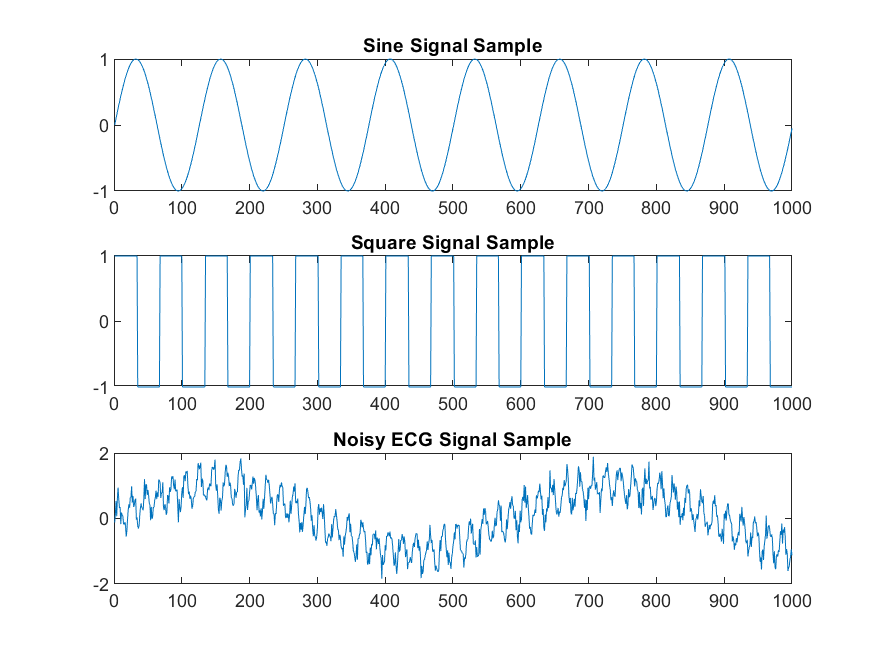
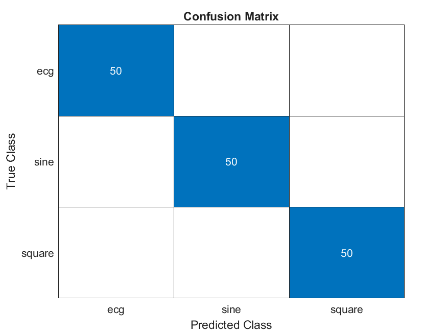
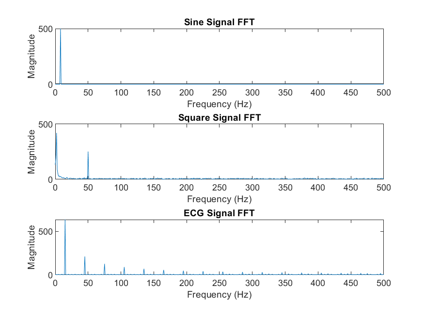

# Signal Classification Using Fast Fourier Transform (FFT)

## Project Overview

This project implements a **signal classification system** using **Fast Fourier Transform (FFT)** to classify synthetic signals (sine, square, and noisy ECG-like) into their respective categories. Built in **MATLAB**, the pipeline leverages FFT to extract frequency-domain features and trains a classifier (Decision Tree or SVM) to distinguish signal types. The system is designed for applications in **signal processing**, such as biomedical signal analysis, audio processing, and communication systems.

The pipeline includes signal generation, feature extraction, model training, evaluation, and visualization. Interactive visualizations provide insights into signal characteristics and model performance.

## Mathematical Foundation

### Fast Fourier Transform (FFT) (Linear Algebra, Discrete Mathematics)

**Why Use Frequency Analysis**: To understand the power of FFT for signal classification, consider distinguishing between a piano and a guitar playing the same note. Each instrument produces unique frequency patterns, like a "fingerprint" in the frequency domain, which are not apparent in raw time-domain data. Similarly, sine, square, and ECG signals have distinct frequency-domain signatures that enable robust classification.

**The Core FFT Formula**: The FFT transforms time-domain signals into frequency components:

\[
X(k) = \sum\_{n=0}^{N-1} x(n) e^{-j \frac{2\pi}{N} kn}
\]

- \(x(n)\): Original signal values over time
- \(N\): Total number of data points
- \(k\): Frequency bin (like different "notes" in the signal)
- \(X(k)\): Magnitude of each frequency component

**What This Does**: Each \(X(k)\) quantifies the strength of a specific frequency in the signal, akin to a spectrum analyzer identifying which frequencies are prominent.

**Why FFT is Fast**: A naive Discrete Fourier Transform requires \(N^2\) operations, but FFT reduces this to \(N \log N\) by recursively dividing the problem into smaller subproblems and reusing calculations. For a signal with 1024 points, FFT performs ~10,000 operations instead of ~1 million.

**Choosing the First 20 Components**: The magnitude \(|X(0)|, |X(1)|, \ldots, |X(19)|\) is used as features because:

- \(X(0)\): Represents the DC component (average signal value).
- \(X(1)\) to \(X(19)\): Capture the most significant low-frequency patterns.
- Higher frequencies often contain noise rather than discriminative signal patterns.

**Energy Conservation**: The total energy in the signal is preserved across time and frequency domains (Parseval’s theorem), ensuring no information is lost during transformation.

### Decision Tree Classifier

**Why Decision Trees Work Well**: Decision trees function like a series of yes/no questions to identify signal types. Each question splits the data into more specific groups, narrowing down to confident predictions based on FFT features.

**Information Theory Foundation**: Decision trees use entropy to measure classification uncertainty:

\[
H(S) = -\sum\_{i=1}^{c} p_i \log_2 p_i
\]

- \(p_i\): Fraction of samples belonging to class \(i\)
- \(c\): Number of classes (sine, square, ECG)

High entropy indicates uncertainty; low entropy implies confidence in class assignment.

**Finding the Best Splits**: The algorithm selects features that maximize information gain:

\[
\text{Information Gain}(S, A) = H(S) - \sum\_{v} \frac{|S_v|}{|S|} H(S_v)
\]

- \(S\): Set of samples
- \(A\): Feature (e.g., FFT component)
- \(S_v\): Subset of samples with feature value \(v\)

This measures how much uncertainty is reduced after splitting on feature \(A\).

**How This Works with FFT Features**:

- Each FFT magnitude serves as a potential splitting point.
- The algorithm identifies thresholds, e.g., "if FFT component 5 > 0.3, likely sine."
- This creates rectangular decision regions in the 20-dimensional FFT feature space.

**Why Trees Stop Growing**:

- All samples in a node belong to the same class (perfect classification).
- Too few samples remain for reliable splits.
- Maximum depth is reached to prevent overfitting.
- Information gain becomes negligible.

### Evaluation Metrics

The confusion matrix visualizes classification performance, with accuracy derived from true positives, true negatives, and errors.

## Technical Implementation

### Core Components

1. **Signal Generation (`generate_signals.m`, `ecg_simulator.m`)**:

   - Generates 50 samples per class (sine, square, ECG) with a sampling frequency of 1000 Hz.
   - ECG signals include noise to simulate real-world conditions, leveraging **calculus** for sinusoidal modeling.

2. **Feature Extraction (`extract_features.m`)**:

   - Computes the FFT of each signal and extracts the first 20 magnitude components.
   - Uses **linear algebra** for vectorized operations and **discrete mathematics** for frequency-domain analysis.

3. **Model Training (`train_model.m`)**:

   - Supports Decision Tree (`fitctree`) or SVM (`fitcecoc`) classifiers.
   - Demonstrates **algorithms** through efficient model training and **probability theory** for class prediction.

4. **Classification (`classify_signal.m`)**:

   - Processes new signals through FFT and predicts their class using the trained model.
   - Reflects robust **algorithmic** design for real-time classification.

5. **Pipeline (`main.m`)**:
   - Orchestrates signal generation, feature extraction, training, evaluation, and visualization.
   - Demonstrates **theory of computation** through structured control flow.

### Signal Types

| Signal Type | Description                             | Features Extracted        |
| ----------- | --------------------------------------- | ------------------------- |
| Sine        | Sinusoidal wave (5-20 Hz)               | FFT magnitudes (first 20) |
| Square      | Square wave (5-20 Hz)                   | FFT magnitudes (first 20) |
| ECG         | Noisy ECG-like (1.7 Hz + 50 Hz + noise) | FFT magnitudes (first 20) |

## Academic and Practical Significance

### Signal Processing Applications

- **Biomedical Signal Analysis**: Classifies ECG-like signals for health monitoring.
- **Audio Processing**: Distinguishes signal types for audio pattern recognition.
- **Communication Systems**: Identifies signal characteristics for modulation analysis.
- **Anomaly Detection**: Detects irregular signals in real-time systems.

## Installation and Usage

### Prerequisites

- MATLAB R2019a or higher
- MATLAB Signal Processing Toolbox
- MATLAB Statistics and Machine Learning Toolbox

### Setup Instructions

1. Clone the repository:

   ```bash
   git clone https://github.com/your-username/signal-classification-fft.git
   cd signal-classification-fft
   ```

2. Ensure MATLAB is installed with the required toolboxes.

3. Run the pipeline:
   ```matlab
   run('main.m')
   ```

## Visualizations

The pipeline generates visualizations to provide insights into signal characteristics and model performance, leveraging **statistics** and **data visualization** techniques.

### Screenshots

Below are key visualizations from the pipeline, highlighting its analytical capabilities:

- **Sample Signals (`figures/sample_signals.png`)**: Displays time-domain plots of sine, square, and noisy ECG signals. This visualization illustrates the distinct temporal characteristics of each signal type, aiding in understanding signal generation (**calculus**, **statistics**).

  

- **Confusion Matrix (`figures/confusion_matrix.png`)**: A heatmap showing true vs. predicted labels for sine, square, and ECG classes. This visualization, grounded in **statistics**, quantifies classification performance and highlights model accuracy.

  

- **Signal FFT (`figures/signal_fft.png`)**: Plots the FFT magnitude spectra for sample sine, square, and ECG signals. This visualization uses **discrete mathematics** and **linear algebra** to showcase frequency-domain differences, critical for feature extraction.

  

## Project Structure

```
signal-classification-fft/
│
├── src/
│   ├── classify_signal.m       # Classifies new signals
│   ├── generate_signals.m      # Generates synthetic signals
│   ├── ecg_simulator.m         # Simulates ECG-like signals
│   ├── train_model.m           # Trains classifier
│   ├── extract_features.m       # Extracts FFT features
│   └── main.m                  # Pipeline orchestration
├── figures/
│   ├── sample_signals.png      # Sample signal plots
│   ├── confusion_matrix.png    # Confusion matrix
│   └── signal_fft.png          # FFT spectra
├── README.md
└── requirements.txt
```

## References

1. Oppenheim, A. V., & Schafer, R. W. (2010). _Discrete-Time Signal Processing_. 3rd Edition. Prentice Hall.
2. Breiman, L. (2001). _Random Forests_. _Machine Learning_, 45(1), 5-32. DOI: 10.1023/A:1010933404324.
3. Vapnik, V. N. (1995). _The Nature of Statistical Learning Theory_. Springer. DOI: 10.1007/978-1-4757-2440-9.
4. [MATLAB Signal Processing Toolbox](https://www.mathworks.com/products/signal.html).
5. [MATLAB Statistics and Machine Learning Toolbox](https://www.mathworks.com/products/statistics.html).

## License

This project is licensed under the MIT License.
